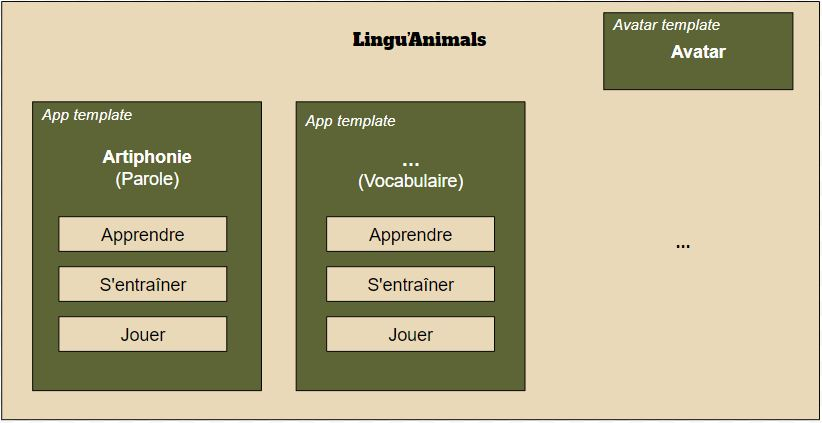
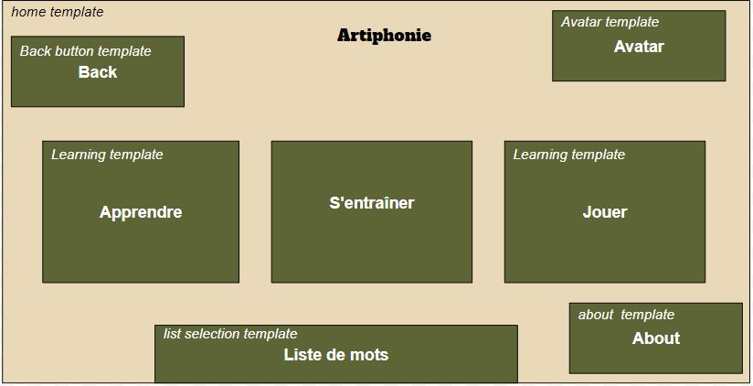
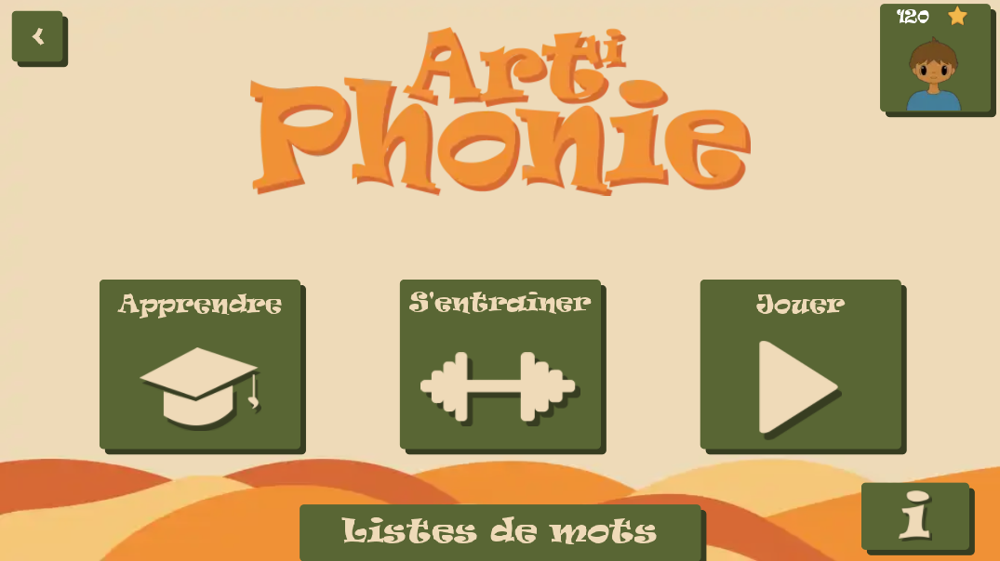
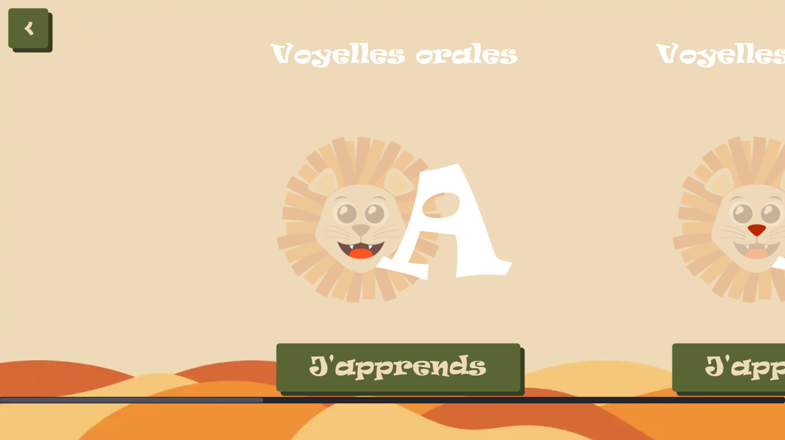
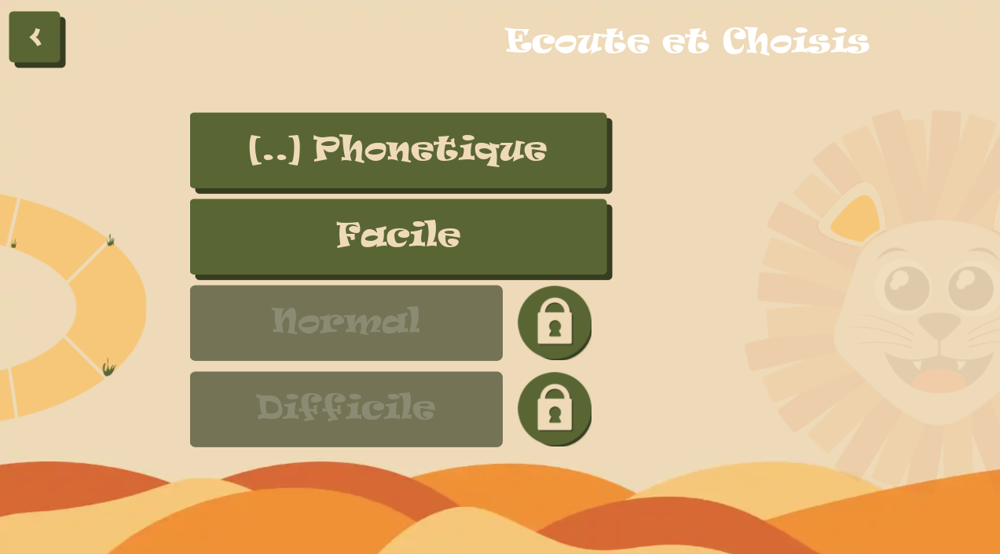
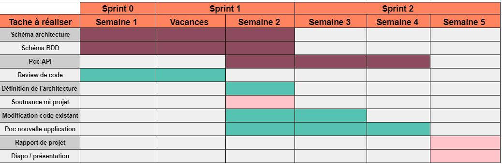
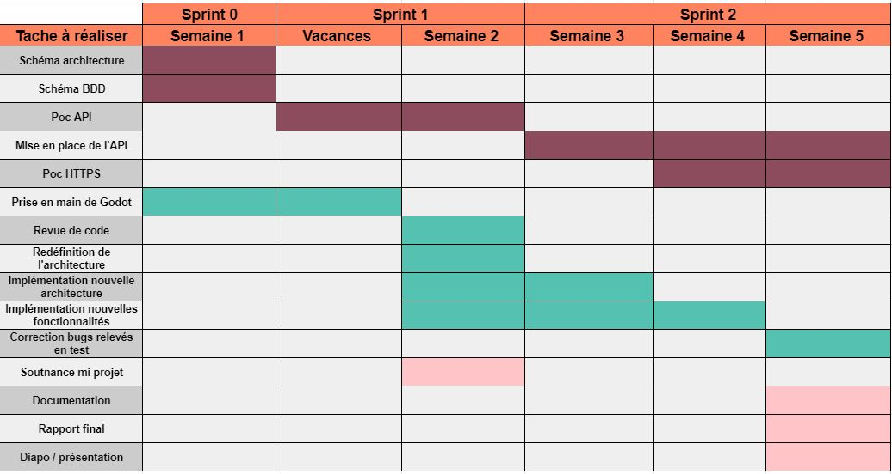

 # Rapport Final - Artiphonie
 
 # Rappel du sujet

 Le projet Artiphonie à débuté en 2020, il porte sur le développement d'une application mobile à destination des enfants atteints de troubles du langage. Le projet est réalisé en partenariat avec une orthophoniste du CHU de Grenoble. Le but de l'application est d’une part d’aider les enfants à améliorer leur prononciation de manière autonome, en dehors des séances d’orthophoniste. D’autre part, de permettre aux orthophonistes de suivre la progression de leurs patients et d’adapter les exercices à leur trouble. 
Des applications similaires existent déjà, cependant, elles sont soit payantes soit disponibles uniquement pour d’autres langues. L’idée est donc de créer une application gratuite et collaborative.

# Objectifs

En ce qui concerne les objectifs à atteindre pour le projet Artiphonie saison 2, ils ont fortement évolué au cours des premières semaines. 
Lorsque nous avons débuté le projet, les objectifs étaient :  
* Une analyse critique de la version actuelle pouvant mener différents développements (refontes partielles, extensions, améliorations) 
* Le développement d’une nouvelle application/extension dans le même domaine. 
Suite à notre rencontre avec Estelle Gillet-Perret, l’orthophoniste qui travaille également sur le projet, nous avons compris que nous allions devoir changer de cap et revoir les objectifs. En effet, il ne s’agissait plus de devoir créer une seconde application, mais de revoir la structure globale du projet pour pouvoir accueillir facilement dans le futur plusieurs sous-applications (une pour la prononciation et une autre pour le vocabulaire par exemple). Il fallait donc revoir l’architecture de l’application pour pouvoir ajouter de nouvelles applications facilement. Il a aussi été question à terme de mettre en place une architecture web qui permettrait de gérer l’application en piochant dans une base de données distante (pour faire des statistiques sur la progression des enfants, créer des jeux personnalisés pour chaque enfant etc.).
Les objectifs ont donc étaient redéfinis comme suit :
* Restructuration de l’application selon une architecture durable
* Amélioration/Correction de bug pour la partie de l’application déjà existante
* Mise en place d’un serveur pour gérer les données de l’application
* Création d’un API qui fera le lien Application-Base de donnée

# Technologies employées

* Le moteur de jeu [godot Engine](https://godotengine.org/)
* Le langage de programmation [GDScript](https://docs.godotengine.org/fr/latest/getting_started/scripting/gdscript/gdscript_basics.html)
* La gestion d’une base de donnée avec [PostgrerSQL](https://www.postgresql.org/)
* Le développement d’une API en [Spring](https://docs.spring.io/spring-framework/docs/current/reference/html/languages.html)
* Serveur [Maven](https://maven.apache.org/)
* Hebergeur service avec [Microsoft Azure](https://azure.microsoft.com/fr-fr/)
* Certification SSL par [Let’s Encrypt](https://letsencrypt.org/fr/)

# Architecture technique

## Front-End

La nouvelle architecture de l’application reprend les éléments présents dans l’application originale, mais utilise les fonctionnalités de godot pour créer des templates qui permettent d’ajouter facilement de futures applications. Elle comprend également un nouveau menu qui permet d'accéder à toutes les sous-applications.

L'image ci-dessous montre l'architecture de la page principale de l'application utilisant les templates :

L'image ci-dessous montre l'architecture de la page principale d'Artiphonie utilisant les templates :

Grâce aux template la plupart des éléments des futures applications ont déjà été pensé et implémenté.

## Back-End

En ce qui concerne l'architecture globale Back-end, nous avons une API qui sert de médiateur entre les différentes plateformes front-end et la base de données. 
Cette dernière tourne actuellement de manière sécurisée sur un serveur Microsoft Azur.

Après réflexion autour des tables et des champs qui devrait être présent dans la Base de donnée, nous avons définis l’architecture de celle ci de la façon suivante :

# Réalisation technique

## Front-End

Sur la partie front end, nous avons tout d’abord pris connaissance du code existant. Pour tester l’application nous avons dû exporter l’application sous Android, cela à été compliqué, nous avons donc réalisé une documentation détaillant les étapes à suivre pour les années futures.
L’application avait été réalisée par une équipe d'INFO 5 de l’année précédente, il y avait déjà une base importante, cependant le code était très statique et n’utilisait pas toujours les fonctionnalités fournies par le moteur godot, il n’était pas évident d'ajouter de nouvelle sous application de cette architecture.

Après le premier rendez-vous avec madame Gillet-Perret et la revue de code, nous avons réalisé que pour créer une application servant de hub pour des futurs sous applications, il faudrait modifier fondamentalement la structure du code existant. Cela nous a amenées  à redéfinir les objectifs, le développement d’une nouvelle application était moins primordiale que de créer une base solide pour les années futures.

Afin de mettre en place le hub d’application, nous avons ajouté un menu avant la page d'accueil de l’application Artiphonie, depuis lequel les différentes sous-application pourront être accédées. Grâce au template d’application réalisé, il est très facile d’ajouter une nouvelle sous application, le détail est expliqué dans le document [creating_a_new_sub_app](../Technical/creating_a_new_sub_app.md).

Nous avons ensuite pensé l’application sous l’angle des éléments qui pourrais être utilisé dans les différentes sous-applications.Nous avons donc découpé l’application en brique élémentaire (home, apprendre, jouer, …) qui serait des templates utilisés pour les futures applications et devait être convertie pour l’application Artiphonie. Nous avons ensuite défini des pièces partagées entre toutes applications (espace avatar, espace de sélection de listes, …).
Ce qui nous a donné 3 templates principaux à utiliser dans chaque application :
* Un template “home”, représentant le menu principal de l’application. Celui-ci est toujours composé de 3 boutons principaux (apprendre, s'entraîner et jouer), d’un accès à l’espace de sélection de listes, d’un accès à l’espace avatar, d’un accès à l’espace “à propos” et enfin d’un bouton retour permettant de quitter cette sous-application et de revenir au menu (le hub).

* Un template “apprendre”, regroupant une liste de vignettes générées automatiquement menant à des espaces d’apprentissages spécifiques (pour Artiphonie un espace pour les voyelles orales, nasales, …), avec la possibilité de modifier les vignettes dynamiquement.

* Un template “jouer”, regroupant une liste de jeux avec diverses difficultés (débloqué ou à débloquer) générées automatiquement en fonction des jeux de l’application courante.

Nous avons ensuite choisi de redéfinir les entités de l’application pour dans un premier temps réduire leur nombre et simplifier leur fonctionnement. Cette redéfinition nous a permis de créer des entités sérialisable et ainsi facile à transmettre à une base de données ou à sauvegarder en local.

### Exemple d'un problème rencontré

Nous avons normalisé l’entité mot sur le front-end et back-end pour qu’elle suive le même format que la base de données open-source [Lexique383](www.lexique.org).
Cela nous a permis de réfléchir au problème de la reconnaissance vocale de mot. Le problème rencontré à été que lorsque l’application doit valider un mot prononcé par l'utilisateur, le reconnaisseur vocal peut ne pas renvoyer le mot attendu, mais un homophone de ce mot (par exemple, si l’on dit “coup” mais que le reconnaisseur nous renvoie “coût”, la prononciation est bonne car les deux mots se prononcent pareille), il faut donc que l’application passe valide quand même le mot s'il a été prononcé correctement. La méthode employée dans la version précédente de l’application fut de rentrer manuellement pour chaque mot la liste de tous ses homophones, cependant cela n’est pas quelque chose de maintenable, car cela empêche l'entrée des mots de manière automatique dans l’application.
Nous avons donc réfléchi au point commun de deux homophones : leur phonétique est identique. Nous avons donc travaillé sur un algorithme permettant de convertir un mot donné dans sa phonétique, or les algorithmes existants se basent sur l’extraction de phonème des mots à l’aide de reconnaissance vocale et de dictionnaire.
Notre solution fut, au final, de réduire la taille de la base de données Lexique383 (de 15 Mo à 2.6 Mo), pour l’intégrer à notre application et d’en extraire rapidement la phonétique d’un mot donnée. Cela permet ainsi de comparer la phonétique de deux mots.
Nous avons redéfini l’entité liste de mots, de sorte à ce que plusieurs listes de mots puissent être associées à un utilisateur et que les listes soient modifiables et possèdent chacune une icône (ou non) car celles-ci doivent être reconnaissable par des utilisateurs qui sont de jeunes enfants qui ne savent pas forcément lire. Cela nous a permis d’intégrer facilement la fonctionnalité de changer de liste dynamiquement dans l’application.

### Exemple d'un ajout de fonctionnalité
Lors du rendez-vous au CHU, Mme Gillet-Perret a insisté sur l’importance des retours positifs pour motiver les enfants à continuer leur entraînement sur l’application. Cela nous a amené à repenser l'espace avatar pour le rendre plus ludique et plus intéressant. Nous avons donc imaginé un magasin dans lequel l’enfant peut acheter de nouveaux objets pour équiper son avatar, comme des chapeaux, des lunettes, …
Le code a été pensé pour être indépendant des types d'objets ou des objets présents dans le magasin, l’ajout de nouveaux objets ou de nouveaux types d’objets se fait donc très facilement en l’ajoutant simplement dans le fichier json qui contient tous les objets.  
Nous avons également prévu un choix d’avatar de base comprenant un garçon et une fille avec différentes couleurs de peau. 

### Pour la suite - front-end

Les futures objectifs pour la partie front-end seraient :
* Ajout de [tests unitaires](https://docs.godotengine.org/en/latest/development/cpp/unit_testing.html) dans godot 
* Développement de la nouvelle application

## Back-End

Le travail en back-end du projet Artiphonie a commencé de zéro. Autrement dit, avant de se lancer dans le développement, notre équipe back-end a dû faire une première analyse complète des besoins et des prérequis nécessaires à la mise en place de bases solides pour l’avenir du projet.

La première tâche principale a été de réfléchir sur l’architecture du projet pour comprendre les différents utilisateurs, leurs liaisons et interactions avec le projet. De même, la constitution du projet est un élément clé où nous retrouvons une partie front-end et une partie back-end. L’application en Godot et un futur site Web forment la partie front-end. Nous retrouvons en back-end, une API permettant une connexion avec une base de données, tout cela hébergé sur un serveur.

La seconde tâche essentielle a été la réflexion sur le diagramme de la base de données. Cette dernière a beaucoup évolué tout au long de l'avancée du projet. Néanmoins, nous avons dû garder en tête que notre base de données pourra éventuellement être utilisée pour effectuer des statistiques plus tard. Une autre contrainte a été de la rendre la plus souple et maniable possible pour éviter d’être limité dans le développement ou de tout revoir.

Ces deux missions nous ont été fondamentales, car aucun back-end n’avait été développé dans la saison 1 d’Artiphonie. 

### 1er preuve de concept
Dans un second temps, nous nous sommes lancés dans la mise en place de notre première preuve de concept. Celle-ci consiste à simuler une connexion entre une BDD et une application Godot par l’intermédiaire d’une API. 
Nous avons dû faire un choix sur les technologies à utiliser pour parvenir à notre objectif. Après comparaison entre les technologies existantes, nous avons décidé de sélectionner celles qui nous semblent les plus répandues de nos jours et les plus performantes dans leur domaine. Nous avons choisi pour l’API et la BDD respectivement Spring et PostgreSQL.
La preuve de concept s’est déroulée en plusieurs étapes :
* Mise en place de la BDD
* Développement de l’API
* Lien entre API et BDD
* Développement application Godot de type formulaire
* Lien entre Godot et API
* Phase de test avec des requêtes HTTP par l’application Godot vers la BDD

*Information : Nous avons dans un premier temps décidé d’effectuer simplement des requêtes GET et POST en HTTP pour simplifier la mise en place de la preuve de concept et effectuer des tests en localhost.*

### Nos premiers pas dans le Back-end
Après cela, l’équipe de back-end s’est lancée dans le développement de la vraie API, avec la mise en place d’une BDD hébergée sur un serveur à distance.
Nous avons choisi comme hébergeur une VM Microsoft Azure à l’aide de nos crédits étudiants pour obtenir une adresse publique et un DNS spécifique pour le projet Artiphonie.

Le serveur déployé tourne actuellement sur la version Ubuntu 18.04 (pour plus d’informations, nous vous invitons à consulter le dépôt git “server” du projet).

La mise en place de la BDD PostgreSQL a été rapidement déployée par la suite à l’aide de la preuve de concept précédemment réalisée.

#### API
Du côté de l’API, une première ébauche de la spécification a été établie à partir du diagramme de la BDD et des besoins attendus par l’orthophoniste. A partir de cette dernière, nous avons implémenté les premières fonctions nécessaires à la communication avec la base de données répondant aux requêtes basiques attendues par l’application Godot. 

Il a fallu ensuite implémenter la base de données réelle en fonction des indications et des besoins de l’application. Cette dernière a d'ailleurs beaucoup évolué tout au long du projet en fonction des nouvelles problématiques qui se posaient au fur et à mesure de notre avancement dans le projet.

Nous avons évidemment par la suite continué à étoffer l’arsenal des fonctions de notre API. Cela tout en restant en contact très régulier avec l’équipe front-end pour savoir exactement quel type de requêtes serait utilisée par l'application pour communiquer avec la base de données.

#### Evolution de la BDD
L’équipe front-end nous a donné des scripts permettant de peupler la base de données en respectant l’architecture choisie pour celle-ci. Ces scripts se basent sur des bases de données open-sources de mots (Lexique383) et de pictogrammes (ARASAAC), et peuplent la base des mots et d’images de notre base de données.

Ces scripts ont soulevé un problème avec l’architecture de notre base de données initiale où les mots et images avaient une relation 1-1 entre eux. Car lors de l’export si l’on cherche à associer à chaque mots une image (si elle existe), la base se retrouve peuplé d’un nombre important d’image (8’000 images) mais seulement 8’000 TODO

### Sécurité 
En parallèle, nous avons conscience que les données qui seront enregistrées traitent du domaine médical, donc certaines contraintes se sont ajoutées. Comme par exemple, nous retrouvons le respect de la RGPD du CHU de Grenoble, la mise en place d'outils de sécurité et de supervision du serveur pour limiter toutes attaques.
Dans ce cas, nous nous sommes renseignés sur la RGPD du CHU de Grenoble et avons commencé à réfléchir pour renforcer l’accès à notre BDD par des requêtes non plus en HTTP mais HTTPS à l’aide d’un certificat SSL.

Nous arrivons à notre deuxième preuve de concept qui consiste à développer une application Godot effectuant des requêtes HTTPS vers notre BDD pour s’assurer de contrer l'attaque “Man of the Middle”. Avant cela, nous avons dû créer un certificat auto-signé pour la phase de test sur notre serveur. Puis par la suite, nous avons décidé de remplacer notre certificat auto-signé par un certificat SSL officiel délivré par une CA. Nous avons choisi pour cela la CA “Let’s Encrypt” qui délivre des certificats gratuitement d’une durée de trois mois.

Enfin, la dernière mission effectuée a été le déploiement d’alertes sur notre serveur afin de de superviser ce dernier. Nous retrouvons deux types d’alertes :
* Les signaux indiquant un message erreur interne à notre serveur comme par exemple sur la BDD ou l’API
* Les signaux destinés à Microsoft Azure avec la consommation de crédits, le débit et ressources utilisés, l'accessibilité à notre serveur ...

### Pour la suite - back-end

Les futures objectifs back-end pour la continuité du projet Artiphonie seraient :
* Mettre en place la norme RGPD comme l’étude a été faite
* Crypter les informations dans la base de données ou renforcer la sécurité
* Développer un site Web pour l’orthophoniste communiquant avec la même API

## Pour la suite 

Une fois que la connexion entre la base de données et l'application mise en place il faudrait :
* Créer un compte utilisateur au premier démarrage
* Mettre en place le calculs des statistiques sur les mots
* Faire l'interface web des orthophonistes pour gérer les stats et les listes de mots

# Documentation

Le projet étant voué à être repris par d'autres équipes d’INFO 5 dans les années futures, nous avons mis l'accent sur la documentation, qui manquait, pour leur permettre de reprendre le projet rapidement et facilement. Nous avons donc réalisé tout d’abord un tutoriel imagé qui explique comment [exporter l’application sous Android](../Technical/Android_Export.md). Nous en avons rédigé une documentation qui explique brièvement chaque [élément de l’architecture de l’application](../Technical/app_architecture_godot.md) dans godot. Une autre pour expliquer la démarche pour ajouter de nouveaux éléments : une [nouvelle sous application](../Technical/creating_a_new_sub_app.md) et un [nouveau jeu](../Technical/creating_a_new_game.md).
Nous avons également fait une étude sur la [RGPD](../RGPD.md) en lien avec l’application qui gère des données sensibles, car ce sont des données médicales relatives à des mineurs.  

De plus, sachant que le back-end peut être difficile à comprendre sur les différents choix et l’architecture de ce dernier, nous avons tenu à le rendre le plus précis possible. Nous avons réalisé une documentation sur [l’architecture de la BDD](../Technical/Documentation_Architecture_BDD_ArtiphonieV1.pdf) dont un [schéma](../Technical/Diagramme_BDD.pdf) et une [spécification de l’API](../Technical/Spec_Api.md). Du côté serveur, une [présentation détaillée](https://github.com/WriteInGesturesProject/server/blob/master/README.md) du service est présentée en plus d’une explication des différentes étapes réalisées pour l’installation et la configuration des différentes parties comme la BDD PostgreSQL, l’API et le certificat SSL.

Enfin, [une documentation](https://github.com/WriteInGesturesProject/dev/blob/master/Proof%20of%20concept/README.md) sur les différentes preuves de concepts, qui ont été réalisées lors de ce projet, a été rédigée pour permettre une meilleure compréhension de ces dernières.

# Gestion de projet

Pour la gestion de projet, nous avons appliqué la méthode agile SCRUM. Nous avions donc un chef de projet - Claire Velut - et un SCRUM master - Gaëtan Rival. De part les objectifs du projet nous avons fait deux sous groupes : deux personnes ont travaillé sur le front end de l’application - Morgan Crociati et Claire velut -  et deux autres personnes ont travaillé sur le backend de l’application  - Gaëtan Rival et Rémy Ruzafa.
Les daily meetings nous on permit de garder un lien entre les deux équipes, de discuter de choix techniques et de partager sur l’avancement du projet. 
Github nous a permis de collaborer sur le code, nous avons créer une branche pour chaque nouvelle issues et une pull request assignée à l’autre membre de sa sous-équipe devait être réalisé pour pouvoir *push* le code sur la branche *dev*.
Un *merge* à été fait de la branche *dev* vers la branche *master* à la fin de chaque sprint. 

Au commencement du projet nous avons réalisé un planning prévisionnel après le rendez-vous avec le porteur de projet. 

Celui-ci a beaucoup évolué en fonction de notre avancée et mais également du fait du changement des objectifs. Le planning effectif est le suivant : 

# Outils de collaboration

Nous avons principalement utilisé l’outil de collaboration Github. Le projet contient 3 *repositories* : 
* *dev* qui contient le code godot de l’application sur lequel les développeurs front end ont travaillé et les preuves de concepts réalisées
* *server* qui contient le code Spring de l’API de l’application sur lequel les développeurs back end on travaillé
* *docs* qui contient les document du projet
Nous avons utilisé l'outil de gestion de projet de Github qui permet de définir et d'attribuer des tâches ainsi que d’indiquer leurs états. 
Nous avons également travaillé sur un drive partagé pour partager les comptes-rendus de réunions et rédiger les livrables.

# Métriques logiciels

# Conclusion

Parmi les différents projets sur lesquels nous avons eu l'occasion de travailler durant notre formation à Polytech Grenoble, le projet Artiphonie à été le plus concret et donc celui qui nous a le plus intéressé et motivé. En effet, ce projet a pour but d'être utilisé par de réells utilisateurs : des enfants et des orthophonistes. Cela nous a amenée à échanger avec une orthophoniste pour comprendre ses besoins et ses attentes, mais aussi à se mettre à tout instant du point de vu de l'utilisateur pour réaliser une appliation accessible et ergonomique.

Étant donnée que le projet sera repris par de futures INFO5 et a pour ambition d'être un projet sur le long terme, nous avons adopté en fin de projet le point d'un nouvel arrivant sur le projet. Nous avons donc réfléchis aux points importants à connaître pour reprendre le projet facilement, aux documents que nous pourrions rédiger pour faciliter cette reprise et nous avons mis du soin dans les commentaires.
Cette démarche étant particulièrement interessante, car savoir partager ses connaissances lorsqu'on quitte un projet est une compétence qui nous sera très utile en entreprise.

# Bibliographie
* Documentation [godot](https://docs.godotengine.org/en/stable/)
* [Lexique](http://www.lexique.org/)
* [ARASAAC](https://arasaac.org/)
* Images Borel Maisonny dessinées par Estelle Gillet-Perret
* Vidéo gestes Borel Maisonny réalisées par Estelle Gillet-Perret
