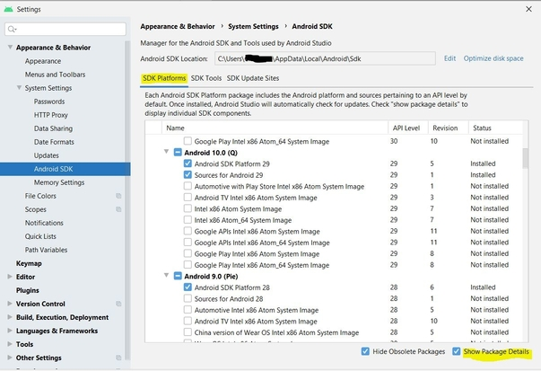
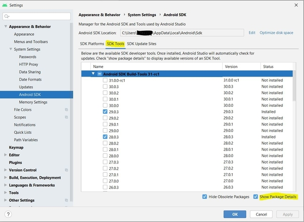
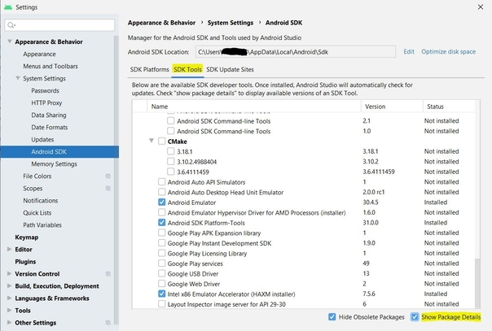
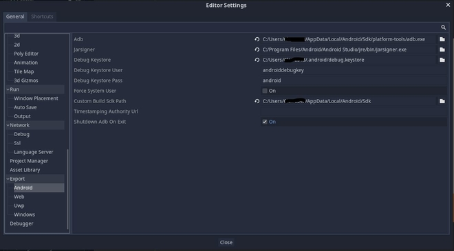
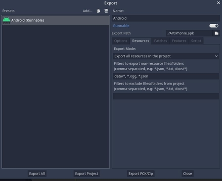

# Table of Contents
1. [Export App to Android](#Android-Export)
2. [Creating a new sub app](#Steps-to-create-a-new-sub-app)
3. [Creating a new game](#Steps-to-create-a-new-game)
4. [Application architecture in godot](#Application-architecture)
5. [Preuve de concept](#Preuve-de-concept)
6. [Architecture Artiphonie](#Architecture-Artiphonie)
7. [Diagramme BDD Artiphonie](#Diagramme-BDD-Artiphonie)
8. [Spécification API Artiphonie Back-end](#Spécification-API-Artiphonie-Back-end)
9. [Serveur Artiphonie](#Serveur-Artiphonie)
10. [RGPD](#RGPD)

-----------------------
-----------------------

# Android Export

This tutorial is meant to describe the steps to follow in order to export Artiphonie project for Android. If you want more general information on [how to export a godot project](https://docs.godotengine.org/en/stable/getting_started/workflow/export/exporting_for_android.html) or on [how to launch a custom build](https://docs.godotengine.org/fr/stable/getting_started/workflow/export/android_custom_build.html) for Android they can be found on the godot documentation. 

# Installation

## Android Studio

First of all downloads and installs [Android Studio](https://developer.android.com/studio/). Launch it and create a first project (which will not be used) in order to complete the SDK setup.
We will now make sure you have the right package for this project. 

Go to `file>Settings` then to the left go to `Appearance & Behavior>System Settings>Android SDK` then on the `SDK Patforms` tab click `Show Package Details` and make sure you have the same package as the image below. 



If not select the package and click `ok`. You may be asked to accept the licence. Make sure to accept it or it may cause problems later. 

Do the same under the SDK Tools tab, click `Show Package Details` and make sure you have the same package as the images below.




If not select the right packages and click `ok`. You may also be asked to accept the licence. Make sure to accept it or it may cause problems later. 

## OpenJDK 

Now download and install [OpenJDK](https://adoptopenjdk.net/index.html). 

## Create a debug.keystore

Go to your `%USERPROFILE%\.android\` directory and use the following command to create a debug.keystore file in the current directory : 
```
keytool -keyalg RSA -genkeypair -alias androiddebugkey -keypass android -keystore debug.keystore -storepass android -dname "CN=Android Debug,O=Android,C=US" -validity 9999 -deststoretype pkcs12
```

# Setting it up in godot

Open `Editor>Editor Setting` scroll down to the Android section.
Modify the path as follow : 



Then open `Project>Install Android Build Template` and install it. 

Finally open `Project> Export…` then you should have the following screen with the preset Android (Runnable) :

.jpg)

If not click the button Add… and add Android (Runnable).

At this point if you're facing an error about a missing template :


Click on `Manage export template` and install the required template.

## Setting up Android parameters

Now that you have Android (Runnable) click on it and on the right in the `Options` tab enable the following option :

```
Clear previous install -> ON
Use custom build -> ON 
Internet -> ON
Manage document -> ON
Modify Audio Settings -> ON
Read External Storage -> ON
Record Audio -> ON
Wrtie external Storage -> ON

```
Now open the `Resources` tab and under `filters to export non-resource files/folder` enter `data/*, *.ogg, *.json` :



## Export the project

There are now two options :

* Obtaining the apk
* Using one-click deploy

### Obtain the apk

In order to get the apk, still in `Project> Export…`, click on the `Export Project` button then save the APK whereever you want on your laptop. You will then be able to download and install the apk on your phone.

At this point you may encounter an error telling you that you have the wrong template version compare to your godot version. If that append open `Artiphonie/dev-master/WriteInGesture/android/.build_version` file and change the version to the right one.

### One-click deploy

Connect your device to your laptop, configure your device by setting it in developer mode. You may also need to Enable `Install via USB` and `USB debugging`.
Click on the Android icon on the top right corner. 

-----------------------
-----------------------

# Steps to create a new sub app

 To add a new sub app to the main app, you must follow a few steps.

# What is a template and how use them

When building a new application you should be using the template that we have made in the shared directory (some are template other are just usefull shared scene).
A template is a scene which can be used to generate automaticaly something when given the correct arguments.

The template is meant to be intanciated in another scene, and this scene should setup the template.

For example in Artiphonie, we have a playing scene which contains the playing template. And when we go the artiphonie playing scene, the scene gives information about the games to the template and the template generate the view. 

# /new\_app and the new app home page
You must create a folder with the name of your app in which you will have all the element which will used the template available in */shared*. Your new app *home* scene must be named by the app name and must be placed directly in this folder (not in another sub folder).
This scene will contain the *home* scene template (and the *instruction* template scene if there is an instruction to explain it). in this scene script you will have to launch the **setup** function from the *home* template whith those following arguments:
 * the path for the **learning** scene of your app
 * the path for the **training** scene of your app
 * the path for the **playing** scene of your app
 * the name of your app

# Global
In the *Global* file you must add to the array **apps** a String with the name of your app.

# Main menu
If you have added your app's name in the *apps* array of *Global* as said in the previous step, your app will be automatically added as a button on the main menu. But you need to add in the **/asset** folder a folder with the name of your app which will contain the logo and icon of your new app.

# About content
You can personalised the about content of your sub app by adding a folder in */data* with the name of your app and with a file named **aboutContent.txt** in it.

# Playing scene and games
For the games there are no templates as the game may be different in each sub app. But you can follow the tutorial [Steps to create a new game](https://github.com/WriteInGesturesProject/docs/blob/master/Technical/creating_a_new_game.md) to add a new game.

The other sections of the app have templates in **/shared** which will allow you to easily add element to your new app. 

-----------------------
-----------------------

# Steps to create a new game

Before viewing this guide, we think you should have read the guide creating_a_new_sub_app.md. Especially the section about template.

## Creating your game

There is no template to make a game, as a game is not something that can be templated as the games can be widly different.

To make a new game, you'll need to make the game in a brand new scene. Feel free to add the back button scene from
template (and change its state if it doesn't fit what you want to do). The game doesn't need to have different difficulties,
however we strongly recommand it.

## Instructions

Your game probably needs to have an instruction playing when it is first launched. To do exactly that, you'll need to use the
instruction template (in shared), simply instanciate it in the Godot editor into your game scene. You'll need to create a JSON
file with 2 keys "sound" and "text" (see below) and an audio file ".ogg" with the text read aloud.
- "sound", has as value the path of the audio to be played
- "text", the text read in the audio file, basicaly a tutorial for your game
The JSON file needs to be located in the art/instruction folder (this is weird and should be changed in the future to separate
instruction by their app names).

Finally, to initiate the instruction simply call first thing in the \_ready() function, $instruction.setUp(nameOfYourGame: String)
with $instruction being the instruction scene instanciated. The function setUp(..) returns true if the instruction is playing and
false if the instruction is not playing (as if the user does not have the instruction activated). If you need to activate a timer
or something else, when your games start (which now means after the instruction finish playing, if the user has the instruction
activated) feel free to connect a function to the signal "on_Pass_Pressed" that instruction will emit when the instruction is
done (see artiphonie/memory/memory_game.gd for a clear example).

## Difficulties

To get which difficulty is selected for the game, you'll need call Global.get_arguments() which will return an array containing only
the name of the difficulty chosen (for exemple: "facile"). Then you process this information as you want. To just get the name of the
difficulty you simply do Global.get_arguments()[0].

## Game end shared scene

When you are done with the game, you will need to calculate the score (number of stars gained) of the player. Once this is calculated
you will need to change scene to the game_end.tscn scene (using Global.change_scene(_,_)). But before changing scene to game_end, you
will need to set an array of all the arguments you need to give game_end. Here's a guide of all the arguments needed for game_end,
keep in mind that game_end needs those arguments but they can be empty (null, 0, "") if they don't fit your game.
- args[0]: String -> Path to the scene of the game just played
- args[1]: Array -> Arguments to give to the scene of the game just
					          played, to replay it with the same difficulty
				            (or other if the arguments are used for something else)
- args[2]: String -> Name of the game just played
- args[3]: String -> Difficulty played
- args[4]: int -> Number of stars gained (score in a way)
- args[5]: int -> If the game played relied on time then this is used to
				          display the time in end game scene

## Game scoring reminder

If your games has difficulty, it is important to keep that in mind the difficulty when calculating the stars gained. For example,
"difficile" award 4 more stars than any other difficulty.

One last thing regarding the score, the game is not meant to punish the player but to encourage the player and keeping him/her
training on his problem (pronounciation for example). So what we decided, is that even if the player does everything wrong he is
still awarded 1 star at the end.

## Linking it to a playing scene (from the template in shared)

Now that your game is done, let's link it to your application.

In the playing scene of your app, call add_playing_element() of the template playing. This function will add your game (and its
difficulties) to the selection screen located in playing. Here's a detailled overview of the arguments needed (in the correct order):
- title: String -> Title of your game
- scenePath: String -> Path of your game scene
- iconPath: String -> Path of the icon of your game
- difficulties: Array -> Array contening the information related to the difficulty of your game, this cannot be left empty as the game needs
a difficulty to start. But if your game does not have difficulties, you could give in the array a difficulty called "jouer" which is considered
as a difficulty when creating the button to launch your game, but forgotten once in your game.
  - difficulties[i] -> [difficultyName: String, locked: bool:, lockedInfo: String]:
    -	difficultyName: String -> Name of the difficulty ("Easy", "Timed", "Impossible")
    -	locked: bool -> Is the difficulty available right now (If locked == false then the difficulty button will be grayed out and not pressable)
    -	lockedInfo: String -> If the difficulty is not available how to unlock it the selection screen (This is not used right now, so you can leave it blank)

Then everything is done, good job!

------------------------
------------------------

# Application architecture

This file describes each element of the app architecture in godot.

## /art

This folder contains every images/sound/video needed in the app. Which means: 
* the avatar pictures
* the Borel Mainsonny images which represent the gesture linked to each phoneme drawn by Estelle Gillet Perret
* the sound for the instruction 
* the image of each item who may be bought in the shop 
* the image for each word in the default lists of words for which will be available without wifi (without needing to be connected to the database)

## /artiphonie

* **/goose_game** contains the scene of the goose game.
* **/learning** contains the learning scene of the sub app Artiphonie which used the *learning* template from */shared*. 
* **/listen_choose** contains the scene of the listen and choose game and the *card_listen_choose* template which represents a card for the game
* **/memory_game** contains the scene of the memory game and the *memory_card* template which represents a card for the game.
* **/playing** contains the scene whihc display the different game available in Arthiphonie and their difficulties, it used the *playing* template from */shared*.
* **/training** contains the training scene of the sub app Artiphonie which used the *training* template from */shared*.
* **/utility** contains the **/prononcing** folder which is used to display a word via different layout, via this the user can train by pronouncing the given word. It is used in the training section and in the lisetn and choose game.
* **artiphonie** is the home page of Artiphonie which used the *home* template from */shared*.

## /assets

This folder contains the assets which means :

* /artiphonie is the folder that contains the logo and icon of the app Artiphonie. For the future apps which will be added to this project a folder must be added with the name of the new app and it may contains the logo and icon too
* the **/fonts** used in the app, the main one is RAVIE.ttf
* the **/icons**
* the success and fail **/sound** which could be change as the failing sound may be harsh 
* the godot **/theme** used in the app

## /data

This folder contains the data of te app, which cannot be seen on godot's file system and which are:

* **/Lexique** which contains the script to convert the Lexique excel into a json file. The list of French words and their phonetic in the *Lexique383_ortho_phon.json* file and a version faster to open for the app but unreadable which is *Lexique383_ortho_phon_ligth.json*
* **/default_list** which contains the default lists of words, a general one with the most common words, then a list for 1, 2 and 3 syllables
* **/artiphonie** wich contain the text file with the content of the about button accessible from the Artiphonie sub app
* **/main_menu** which contain the text file with th content of the about button accessible in the main_menu
* **general.json** contains all the data related to the player with those parameters :
    * the player name
    * the number of *stars* he has
    * it's avatar *ethnicity*, the avatar were made in various skin color, this number will define which version of the avatar will be used for this player
    * the avatar *gender* to choose the right avatar image
    * if *instruction* equals true the first time the player goes to a new area in the app the instruction will be displayed, if its set to false it won't
    * the list of equipped items, only one item of each category may be equipped
    * the list of unlocked item, which mean all the items which were bough and may be equipped
    * the list of words which is a list of lists that the player will found in the app, the player can choose which list of words he wants to use for the games from this list of lists
* **phonetic_table.json** wich contains a dictionary with the phonetics codes used in the app as key and the real phonetics symbols as value.
* **phonetic_table_ressource.json** wich contains a dictionary with the phonetics codes used in the app as key and the phonetics code used for the resources (image/video) names as value.
* **phonetic_table_soted.json** wich contains the phonetics code, sorted by types.
* **shopItem.json** contain all the items available in the shop with those parameters : 
    * the item name which must be unique
    * it's price
    * it's type, if an item with a new type is added in the shopItem file it will be handle in the shop in the avatar space, so a new type of item can easily be added
    * the picture path which is actually the picture name as the code know where are stocked all the shop images


## /entity

This folder contains the Entities used in the app which are not linked to a scene in godot. 

* **Entity** is a class which is meant to be extended by all entities, this simplifies the process when handling entities.
* **Item** is the entity for all the items in the shop, every item of the same type has to have a different name.
* **Player** is what is used when using the app, by default if a player is not logged in, *Global* will load a default player where nothing can be saved (data/default.json).
* **Shop** contains all the item available in the shop, it is useful when viewing the shop on the avatar space.
* **Word** represent a word, with it's phonetic code and it's icon path.
* **Words** represent a list of words.

## /shared
This folder contains all the elements of the app that are shared between the different sub apps. They are templates used in the Artiphonie sub app and they will be useful for the other sub app in the future.
An instance of those shared templates can be added to scene in the sub app's folder.

* **/about** folder contains the *about* scene which displays the about informations, this scene can be used in different scenes of the app by adding the *abou_button* scene. 
* **/avatarspace** contains the avatar space template, which can be add to other scene like the main menu and home via the *avatar_button*. It contains the *avatar_space* scene who manage the player *pictureProfil* which is updated when a new item is equipped and the shop which is composed of the *item_type* and the *item*. 
* **/back** the back button template which is used in most of the other scene. It has 3 states: 
    * back: Return to the previous scene (which is the scene the player previously was on) so this is useful when we want to automate the process which is most of the time however it does not work when we don't want the player to goes back to the previous scene, for example in a game when the player go to the end game scene we want him to go back to the playing page which is not the previous scene.
    * home: Return to the home scene of the current app.
    * custom: Here you specify the path and the args given, and it could go anywhere.
* **/game_end** contains the template of the scene launch when a game is ended. This scene displays the number of stars earn during the game and allows the plyer to replay.
* **/home** contains the home template which is meant to be used to be the home screen of every application.
* **/instruction** contain the *instruction* template which is meant to be launch when the player enters a scene, it will provide an explanation of the interface to the user.
* **/learning** contains the *learning* scene which displays a *learning_element* for each word in the player's active list of words. A *learning_element* will display the word, an image of the word, the Borel Maisonny drawing related to this word phonetic code, a sound button which will tell the word and a mic button which will record the player pronouncing the word and will give him a feedback via a success/fail sound.
* **/list_selection** contains the *list_selection* scene which allows to change the list of words used for the game and the training section, it is composed of *list_element* which represent each list available. When a list is add for the player, a new *list_element* will be added in the *list_selection*. 
* **/loading** contains the loading scene which is used when the app takes time to be launched.
* **/main_menu** contains the scene for the main menu of the app, from which you can go to the different sub app. The *app_element* scene is a button which represents a sub app with its icon and logo, by adding a new instance of an *app_element* to the main menu, you can add a new app. 
* **/playing** contains the *playing* template on which you add *playing_element* which represent different games that the user can play. On each *playing_element* are added *element_difficulty* which display the different difficulties available for a game. 
* **artiphonie** is a file which contains the global constant only related to the sub app Artiphonie. A similar file could be created when a new sub app is added.

## Global
This file contains the globals variable and functions which can be used everywhere in the app.
## main
 This is the first scene to be launch when the player opens the app. On the first launch it will asked the user for permissions and init the textToSpeech and speechToText API.

 -------------------------
 -------------------------
 
 # Preuve de concept :

## 1/ Application Godot communiquant avec une BDD par l'intermédiare d'une API

### *Outils et logiciels prerequis :*
- une **API en Spring** à l'aide d'Eclipse ou Visual Studio Code
- une **BDD PostgreSql** hebergée en local
- un gestionnaire de BDD PostgreSQL comme **PG Admin**
- un outil de requete HTTP comme **PostMan**
- l'outil de développeur **Godot**
- une plateforme pour analyser les requetes HTTP comme **Requestbin.net**

### *Objectif :*
> L'objectif de cette preuve de concept est de développer une application en Godot permettant de communiquer avec une base de donnée. Pour cela, nous allons utiliser une API developpée en Spring permettant d'effectuer des requetes vers la base de donnée qui sera en PostgreSQL. Au final, nous parviendrons à alimenter la base de donnée par l'application Godot et nous pourrons afficher des données sur notre dernière. Les requetes sont des requetes POST et GET par le protocol HTTP.

### *Information :*
- **PG Admin** permet d'avoir une interface graphique de la BDD
- **PostMan** nous sert pour envoyer des requetes HTTP¨sans passer par Godot pour effectuer des tests sur l'API et la BDD
- **Requestbin.net** permettra d'analyser les entetes des requetes HTTP de Godot et leurs contenues

### *Etapes :*

1. Installer les outils et logiciles necessaires
2. Recuperer le code de l'API developper en Spring sur le Git
3. Recuperer le code de l'application Godot sur le Git qui effectue le rôle d'un formulaire
4. Lancer le serveur PostgreSQL puis PG Admin
5. Lancer l'API à l'aide d'un compilateur JAVA
6. Effectuer des tests vers l'API à l'aide de PostMan afin de s'assurer que votre API est bien liée à la BDD
7. Lancer l'application Godot, remplir le formulaire et regarder le résultat dans la console

**/!\ Important**
* Vérifier que l'API est le champ mot de passe compléter dans ses propriétés pour autoriser l'accès vers la BDD
* Vérifier que les adresses privées/publiques ou localhost qu'ainsi les ports correspondents sur Godot et l'API

## 2/ Application GODOT avec requetes HTTPS

### *Outils et logiciels prerequis :*

- l'outil de développeur **Godot**
- un **serveur** hebergeant **un service en HTTPS** (dans notre cas il s'agit de notre API avec la BDD) avec un accès sécurisé à l'aide d'un certificat délivré par une CA
- **Wireshark** pour anlayser le flux de donnée

### *Objectif :*
> L'objectif de cette preuve de concept est de parvenir à établir des requêtes HTTPS de l'application Godot vers la BDD par l'intermédiaire de l'API. Pour cela, nous devons renforcer la sécurité de l'application en lui permettant d'effectuer des requêtes HTTPS sans rique d'attaque "Man of the Middle".

### *Etapes :*

1. Installer les outils et logiciles necessaires
2. Vérifier que le serveur hébergeant le service HTTPS est bien configuré
3. Lancer le serveur
4. S'assurer que le certificat de notre dDNS est bien à jour, valide et officiel
5. Lancer l'application Godot HTTPS recupérée auparavant sur le Git
6. S'assurer que les requetes HTTPS vers le serveur sont bien sécurisées 

-------------------------
-------------------------
 # Architecture Artiphonie  
 
 
   
   
 
 -------------------------
-------------------------
 # Diagramme BDD Artiphonie
 
 ## Schéma
  
  
 ## Spécification
 
**enfant** (Table principale) : Représente l’entité Enfant dans l’application Artiphonie.
- *id (clé primaire)* : long , Identifiant de l’enfant
- nom : text, Nom de l’enfant
- prenom : text, Prénom de l’enfant
- ethnicité : text, ethnicité de l’enfant ( pour de potentielle statitiques)
- sexe : text, Sexe de l’enfant
- age : int, Age de l’enfant
- id_ortho : int, Identifiant de l’orthophoniste auquel l’enfant est rattaché
- nb_etoile : int, Nombre d’étoile que l’enfant à gagner sur l’application grâce aux jeux
- id_objet : int, Identifiant de l’objet que l’enfant a choisi
- login : text, Login d’accès au compte de l’enfant
- password : text, Mot de passe d’accès au compte de l’enfant  

id_ortho (table enfant) = id (table orthophoniste)  
id_objet (table enfant) = id (table objet)  


**Objet** (Table principale) : Représente l’entité Objet que l’enfant peut choisir en jouant sur l’application Artiphonie
- *id (clé primaire)* : long, Identifiant de l’objet
- nom_avatar : text, Nom donné à l’objet
- cout : int, Cout pour débloquer l’objet par l’enfant
- type : int, Défini le type de l’objet ( pull, chapeau …)


**orthophoniste** (Table principale) : Représente l’entité Orthophoniste dans l’application Artiphonie
- *id (clé primaire)* : long, Identifiant de l’orthophoniste
- nom : text, Nom de l’orthophoniste
- prenom : text, Prénom de l’orthophoniste
- login : text, Login de l’orthophoniste pour accéder à son compte
- password : text, Mot de passe de l’orthophoniste pour accéder à son compte
- email : text, Email pour contacter l’orthophoniste

**succes** (Table association) : Représente l’ensemble des avatars que l’enfant à débloquer sur son compte  
- *id_avatar, id_enfant (clé primaire)*  

id_avatar (table succes) = id (table objet)  
id_enfant (table succes) = id (table enfant)  


**liste_mot** (Table principale) : Une liste de mot est une entité ayant son propre ID. Chaque liste de mots est liée à un enfant et est composée d’un ou plusieurs mots.
- *id (clé primaire)* : long , Identifiant de la liste de mot.
- id_enfant : int, Identifiant de l’enfant auquel la liste de mot est rattachée.
- nb_mot : int, Le nombre de mots contenus dans la liste.
- nom: text, Nom de la liste de mot
- image: text, Nom de l’image de la liste de mot.
- nb_tentative: int, Nombre de fois où l'enfant à travaillé sur la liste.  

id_enfant (table liste_mot) = id (table enfant)  


**mot_liste** (Table association) : Permet de retrouver les différents mots contenus dans une liste en particulier.
- *id_liste_mot, mot (clé primaire)*

id_liste_mot (table mot_liste) = id (table liste_mot)  
mot (table mot_liste) = mot (table mot)  


**mot** (Table principale) : Représente un mot utilisé pour l’apprentissage des enfants.
- *id ( clé primaire)*: long, Représente mot en lui-même. 
- ortho: text, Orthographe du mot
- phon : text, Phonetique du mot
- cgram: String, catégorie grammaticale
- freqfilms2: int,  frequence apparition mot dans échantillon
- bphons,text,
- p_cvcv, structure grammaticale phonétique
- nbsyll: int, Nombre de syllabe
- image: String, Nom de l’image lié au mot

id_son (table mot) = id (table son)  


**statistique_mot** (Table association) : statistique_mot permet d’obtenir des informations concernant un mot pour un enfant en particulier afin de connaître les difficultés/points forts de ce dernier. Une statistique de mot pour un enfant est définie par une date pour permettre un suivi de la progression de l’enfant dans le temps. En effet, il sera possible de comparer les performances d’un enfant pour un mot donné un jour X avec celles de ce même enfant un jour Y. Voir même comparer différents enfants entre eux.
- *id_enfant, mot ( clé primaire)*
- *date ( clé primaire )* : date, Date à laquelle les statistiques ont été calculées.
- nb_tentative : int, Nombre de tentative d’un enfant pour un mot sur une période donnée
- nb_erreur : int, Nombre d'erreurs d’un enfant pour un mot sur une période donnée.
- commentaire : text, Bref discriptif de l’analyse.

id_enfant (table statistique_mot) = id (table enfant)  
mot (table statistique_mot) = mot (table mot)  

**image** (Table principale) : Représente l’ensemble des images enregistrées liées au mots sur l’application Artiphonie
- *id (clé primaire)* : long, Identifiant de l’image
- nom : text, Nom de l’image
- image: bytearray, L’image sous forme de tableau de d’octets
- type : text, Type d’image comme par exemple une image illustrative, d’aide à la prononciation ...
- description : text, Bref descriptif de l’image

 -------------------------
 -------------------------
 
 # Spécification API Artiphonie Back-end
 
*Ceci est une première ébauche de la spécification de l’API hébergée sur un serveur à distance. Elle sera forcément amenée à être complétée par la suite selon l’évolution du projet pour s’adapter au maximum aux divers besoins de l’application.*

**Version 1 : 05/03/2021**  
Version 2 : XX/XX/XXXX

**Objet:**  

	public ResponseEntity<Objet> getObjetByID(Long objetID){

	public Map<String, Boolean> deleteObjet ( Long objetID ) {

	public List<Objet> getAllObjet(){

	public Avatar createObjet(Objet objet) {

	public ResponseEntity<Objet> updateObjet(Long ObjetId, Objet objetdetails){

	public ResponseEntity<Objet> getObjetByName(String objetName){

**Enfant :**

	public ResponseEntity<Enfant> getEnfantByID(Long enfantID){

	public Map<String, Boolean> deleteEnfant ( Long enfantID ) {

	public List<Enfant> getAllEnfant(){

	public Enfant createEnfant( Enfant enfant) {

	public ResponseEntity<Enfant> updateEnfant (Long EnfantID, Enfant enfantdetails)

	//Retourne l’enfant si la connection est validée null sinon
	public ResponseEntity<Enfant> getEnfantConnection(String login,String password){

	public Enfant getEnfantByName( String name){

	//Récupère la liste des objets que l’enfant a débloqué.
	
	public List<Objet> getMotByListe_MotName( String enfantLogin){

	public Enfant getEnfantByLogin( String login){

	//Recupère l’orthophoniste de l’enfant
	public Orthophoniste getEnfantOrtho(@PathVariable(value = "id") Long enfantID){

	//Récupère le liste des Liste_mot liées à l’enfant
	public List <Liste_mot> getListe_motByEnfantName(String login){

	//Ajoute un objet à la liste des objets débloqués
	public ResponseEntity<Enfant> addObjetEnfant( Enfant enfant, String login) {

**Orthophoniste :**

	public ResponseEntity<Orthophoniste> getOrthophonisteByID(Long orthophonisteID){

	public Map<String, Boolean> deleteOrthophoniste ( Long orthophonisteID ) {

	public List<Orthophoniste> getAllOrthophoniste(){

	public Orthophoniste createOrthophoniste( Orthophoniste orthophoniste) {

	public ResponseEntity<Orthophoniste> updateOrthophoniste (Long orthophonisteID, Orthophoniste orthophonistedetails)

	public ResponseEntity<Orthophoniste> getOrthophonisteConnection( String login, String password){

	//Retourne la liste des enfants d’un orthophoniste en prenant le nom en argument
	public List <Enfant> getEnfantsByName( String name){

	public Orthophoniste getOrthophonisteByLogin(String login){


**Liste_mot :**

	public ResponseEntity<Liste_mot> getListe_motID(Long ID){

	public Map<String, Boolean> deleteListe_mot ( Long ID ) {

	public List<Liste_mot> getAllListe_mot(){

	public Liste_mot createListe_mot( Liste listemot) {

	public ResponseEntity<Liste_mot> updateListe_mot (Long liste_motID, Liste_mot liste_motdetails)

	// Récupérer les mots de la liste de mots 
	public List<Mot> getMotByListe_MotName(String liste_motName){

	public ResponseEntity<Liste_mot> getListe_motByName(String liste_motName){

	//Retourne l’enfant lié à la Liste_mot
	public Enfant FromList(String name){

	//Ajoute un mot à la liste de mot
	public ResponseEntity<Liste_mot> addMotList( Liste_mot liste_mot,  String liste_motName) {


**Mot :**

	public ResponseEntity<Mot> getMotByID(Long ID){

	public Map<String, Boolean> deleteEnfant ( Long ID ) {

	public List<Mot> getAllMot(){

	public Mot createMot( Mot mot) {

	public ResponseEntity<Mot> updateMot (Long MotID, Mot motdetails)

	//Retourne les mots en fonction de  l’orthographe
	public List <Mot> getMotByName(String motName){

	//Retourne la phonetic en fonction de l’orthographe
	public String getMotPhoneticByName(String motName){

**Image :**

	public ResponseEntity<Image> getImageByID(Long ID){

	public Map<String, Boolean> deleteImage ( Long ID ) {

	public List<Image> getAllImage(){

	public ImagecreateImgae( Image image) {

	public ResponseEntity<Image> updateImage (Long ImageID, Image imagedetails)
	
	//Renvoie l’image sous forme de byteArray en fonction de son nom
	public byte[] getImageByName(String nom)  {

 -------------------------
 -------------------------
 
 # Serveur Artiphonie

  
**Groupe INFO5A 2020/2021 :**  
*Morgan Crociati*  
*Claire Velut*  
*Rémy Ruzafa*  
*Gaëtan Rival*  

## Informations Actuelles :

 

* Hebergeur : VM Azure Microsoft
* Nom Machine : ArtiphonieServer
* Système Exploitation : Serveur Ubuntu 18.04
* Adresse Publique : **51.124.109.83**
* Port HTTPS : **8443**
* DNS : **artiphonie.westeurope.cloudapp.azure.com**
* Taille : Standard B1s
* Processeur : 1 (Virtuel)
* RAM : 1 Gio
* Date de fin du certificat SSL : 13/06/2021

## Mise en place du serveur :  

Dans notre cas, nous avons choisi comme herbergeur *Microsoft Azure* et comme système d'exploitation pour le serveur *Ubuntu version 18.04*


### Installation Serveur PostgreSQL et configuration :
1. Installer le serveur à l'aide de la commande suivante :

    `sudo apt install postgresql`
2. Puis créer une table de donnée avec les commande suivantes :

    `sudo -i -u postgres #Se connecter à la base`  
    `createdb <NomTable> #Dans notre cas la table se nomme "Projet"`
    
3. Optionnel : SI vous devez supprimer la table vous devez tout d'abord vérifier qu'aucune session n'est ouverte, si c'est le cas faite :  

        SELECT pg_terminate_backend(pg_stat_activity.pid)
        FROM pg_stat_activity  
        WHERE pg_stat_activity.datname = 'NOM BDD' -- ← Change avec votre BDD  
        AND pid <> pg_backend_pid();
    
    Puis une fois fait, supprimer la base avec la commande ci-jointe :  
    
    `dropdb <NomTable>`
    
### Installation API et configuration :
1. Cloner le dépot git sur le serveur :
  `git clone https://github.com/WriteInGesturesProject/server.git`
2. Ensuite vérifier les informations dans le fichier **application.properties** en complétant les champs manquants
3. Assurez vous que votre serveur possède les mêmes ports configurés qu'avec l'API avec aucune restriction dessus (dans notre cas nous avons dû configurer un port 8080 pour les tests HTTP et un port 8443 pour les requetes HTTPS)
4. Puis éxecuter le script Maven avec la commande :
  	`./mwvn`
    
    **Informations complémentaires :**  
    Il est possible qu'il vous manque le JDK compatible avec l'application, pour cela nous avons codé l'API sous JAVA 11 donc installer le **JDK 11** sur le serveur à l'aide du lien suivant : https://doc.ubuntu-fr.org/openjdk

### Installation certificat SSL et configuration :

Deux possibilitées :
- Soit nous créons un certificat auto-signé (Utilisable pour une phase de test)
- Soit nous créons un certificat délivré par une CA (Obtention d'un certificat officiel)

#### 1. Certificat auto-signé
1. Générer un certificat SSL dans un keystore  
    `keytool -genkeypair -alias TOCOMPLETE -keyalg RSA -keysize 2048 -storetype PKCS12 -keystore keystore.p12 -validity 3650 -storepass TOCOMPLETE`  
    Nous avons choisi le format PKCS12 au lieu de JKS pour une meilleure compatibilité avec l'API en Spring. Java ne peut traiter que des certificats en PKCS12.
2. Configurer HTTPS dans Spring Boot
    Dans le fichier 'application.properties' ajouter les lignes suivantes :  
    
        server.port=8443
        server.ssl.key-store-type=PKCS12
        server.ssl.key-store=classpath:keystore.p12
        server.ssl.key-store-password=TOCOMPLETE
        server.ssl.key-alias=TOCOMPLETE
        security.require-ssl=true
  
3. Distribuer le certificats SSL aux clients  
    Transformer notre clé PKCS12 en certificat CRT :  
    `keytool -export -keystore keystore.jks -alias TOCOMPLETE -file myCertificate.crt`
    
    Installer le certificat obtenu sur notre machine client

4. S'assurer que l'accès au site est bien en HTTPS

#### 2. Certificat distribué par une CA
1. Utiliser la CA **Let's Encrypt** afin d'obtenir notre certificat officialisé 
    *Lien utile : https://letsencrypt.org/fr/*
2. Convertir notre jeu de clé obtenu en certificat PCKS12  
`openssl pkcs12 -export -out Cert.p12 -in TOCOMPLETE -inkey TOCOMPLETE -passin pass:TOCOMPLETE -passout pass:TOCOMPLETE`
3. Configurer HTTPS dans Spring Boot
    Dans le fichier 'application.properties' ajouter les lignes suivantes :  
    
        server.port=8443
        server.ssl.key-store-type=PKCS12
        server.ssl.key-store=classpath:Cert.p12
        server.ssl.key-store-password=TOCOMPLETE
        security.require-ssl=true
 
 4. S'assurer que l'accès au site est bien en HTTPS

**Informations complémentaires :**  
Attention, le certificat SSL délivré par Let's Encrypt est d'une durée de 3 mois.

Pour renouveler le certificat SSL déja existant, voici la commande a utiliser :
`sudo certbot renew --dry-run`  
*Lien utile : https://certbot.eff.org/lets-encrypt/ubuntubionic-other* 

### Objectifs :
- API (*DONE*)
- BDD (*DONE*)
- HTTPS (*DONE*)
- RGPD (**TO DO**)
- Cryptage BDD (**TO DO**)
- Site Web (**TO DO**)

 -------------------------
 -------------------------
 # RGPD 

La RGPD ne s’applique pas si l’application mobile enregistre et conserve les données personnelles exclusivement localement, comme dans la première version de l’application.
Par contre elle s’applique dès lors qu’on peut accéder à ces informations à distance. Ainsi la mise en place d’une base de données dans une nouvelle version de l’application
est soumise à la RGPD. 

Il faut alors définir la finalité des données recueillies, il faut que celle-ci soit transparente et légitime. 
Uniquement les données essentielles devront être collectées et elles ne pourront pas être traitées pour d'autres finalités. 
Ainsi, il faudra prévoir les différentes finalités, dans notre cas dans un premier temps le suivis de la progression des enfants et dans un second temps l’étude des données
pour la recherche. Il faudra également veiller dès la conception de l’application à la sécurisation et la protection des données.
Un data mapping doit être réalisé pour cartographier la transmission des données. 
Dans notre cas, une fois que l’enfant n’est plus suivi par un professionnel, ses données peuvent être anonymisées pour servir dans des travaux de recherche. 
Il faudra préciser à l'utilisateur les finalités, la durée de conservation des données et ses droits par rapport aux données le concernant : la rectification, 
l’opposition ou la suppression de données à son sujet.

En bref l’utilisateur doit avoir connaissance de : 
 * Quelles données sont récoltées ?
 * Pour quelle finalité ?
* Comment et où les données sont stockées ?
* La durée de conservation des données ?
* Ses droits sur ses données recueillis (rectification/opposition/suppression)

De plus, le consentement de l’utilisateur doit être recueilli pour l’utilisation des données le concernant. 
Dans notre cas, comme nous traitons des données de santé relatives à des mineurs, un consentement doit être accordé par une personne exerçant une “responsabilité parentale”
sur le mineur. Puisque l’application sera proposée aux utilisateurs par le biais de l’orthophoniste, celle-ci pourrait récolter l’autorisation parentale par la signature
d’un document et pourra apporter toutes les informations nécessaires pour expliquer les finalités de la récolte de données.
Cependant, il faudra quand même faire apparaître toutes les informations nécessaire dans la section “à propos” de l’application. 

Il faudra définir un responsable de traitement, qui pourrait être le responsable de traitement du CHU de Grenoble.

Pour des données sensibles, une analyse d’impact doit être menée.
Les données recueillies ici sont des données de santé relatives à des mineurs donc considéré comme sensible, cependant si le responsable de traitement estime que 
les risques sur les droits et les libertés des personnes concerné sont faible, il est possible de ne pas réaliser d’analyse d’impact. 
De plus, si une analyse d'impact pour un projet similaire a déjà été réalisée, l’analyse peut être utilisée à nouveau. Cependant, le responsable de 
traitement doit transposer l’analyse à sa situation. Il faudrait donc faire des recherches de ce côté pour voir si une analyse d’impact peut être reprise.

# Bibliographie
[Applications mobiles en santé et protection des données personnelles : Les questions à se poser](https://www.cnil.fr/fr/applications-mobiles-en-sante-et-protection-des-donnees-personnelles-les-questions-se-poser)

[RGPD : donnée concernant la santé](https://editioneo.com/blog/rgpd-donnees-concernant-la-sante/)

[Applications mobiles en santé et protection des données personnelles ](https://www.optimex-data.fr/2020/01/10/applications-mobiles-en-sante-et-protection-des-donnees-personnelles-les-questions-a-se-poser/#:~:text=Les%20donn%C3%A9es%20collect%C3%A9es%20peuvent%20%C3%AAtre,sensibles%20%C2%BB%20au%20sens%20du%20RGPD.&text=Les%20donn%C3%A9es%20collect%C3%A9es%20par%20l,pour%20lesquelles%20elles%20sont%20collect%C3%A9es)

[Quelles formalités pour les traitements de données de santé à caractère personnel ?](https://www.cnil.fr/fr/quelles-formalites-pour-les-traitements-de-donnees-de-sante-caractere-personnel)

[Analyse d'impact - legislation](https://www.legifrance.gouv.fr/jorf/id/JORFTEXT000037559518)
