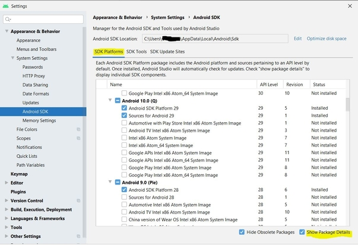
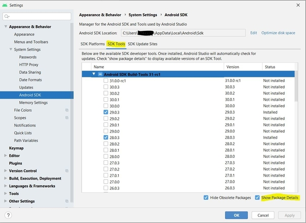
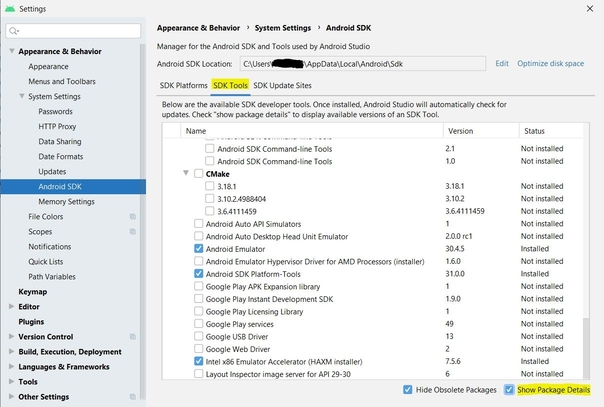
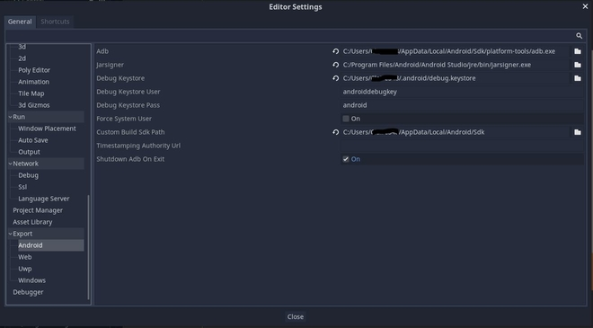
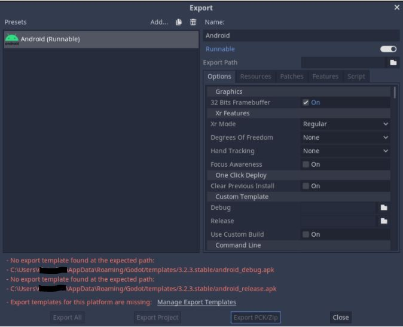
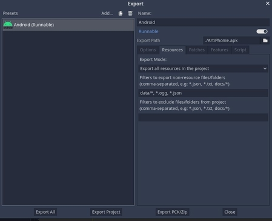

# Android Export

This tutorial is meant to describe the steps to follow in order to export Artiphonie project for Android. If you want more general information on [how to export a godot project](https://docs.godotengine.org/en/stable/getting_started/workflow/export/exporting_for_android.html) or on [how to launch a custom build](https://docs.godotengine.org/fr/stable/getting_started/workflow/export/android_custom_build.html) for Android they can be found on the godot documentation. 

# Installation

## Android Studio

First of all downloads and installs [Android Studio](https://developer.android.com/studio/). Launch it and create a first project (which will not be used) in order to complete the SDK setup.
We will now make sure you have the right package for this project. 

Go to `file>Settings` then to the left go to `Appearance & Behavior>System Settings>Android SDK` then on the `SDK Patforms` tab click `Show Package Details` and make sure you have the same package as the image below. 



If not select the package and click `ok`. You may be asked to accept the licence. Make sure to accept it or it may cause problems later. 

Do the same under the SDK Tools tab, click `Show Package Details` and make sure you have the same package as the images below.



If not select the right packages and click `ok`. You may also be asked to accept the licence. Make sure to accept it or it may cause problems later. 

## OpenJDK 

Now download and install [OpenJDK](https://adoptopenjdk.net/index.html). 

## Create a debug.keystore

Go to your `%USERPROFILE%\.android\` directory and use the following command to create a debug.keystore file in the current directory : 
```
keytool -keyalg RSA -genkeypair -alias androiddebugkey -keypass android -keystore debug.keystore -storepass android -dname "CN=Android Debug,O=Android,C=US" -validity 9999 -deststoretype pkcs12
```

# Setting it up in godot

Open `Editor>Editor Setting` scroll down to the Android section.
Modify the path as follow : 


Then open `Project>Install Android Build Template` and install it. 

Finally open `Project> Export…` then you should have the following screen with the preset Android (Runnable) :

.jpg)

If not click the button Add… and add Android (Runnable).

At this point if you're facing an error about a missing template :



Click on `Manage export template` and install the required template.

## Setting up Android parameters

Now that you have Android (Runnable) click on it and on the right in the `Options` tab enable the following option :

```
Clear previous install -> ON
Use custom build -> ON 
Internet -> ON
Manage document -> ON
Modify Audio Settings -> ON
Read External Storage -> ON
Record Audio -> ON
Wrtie external Storage -> ON

```
Now open the `Resources` tab and under `filters to export non-resource files/folder` enter `data/*, *.ogg, *.json` :



## Export the project

There are now two options :

* Obtaining the apk
* Using one-click deploy

### Obtain the apk

In order to get the apk, still in `Project> Export…`, click on the `Export Project` button then save the APK whereever you want on your laptop. You will then be able to download and install the apk on your phone.

At this point you may encounter an error telling you that you have the wrong template version compare to your godot version. If that append open `Artiphonie/dev-master/WriteInGesture/android/.build_version` file and change the version to the right one.

### One-click deploy

Connect your device to your laptop, configure your device by setting it in developer mode. You may also need to Enable `Install via USB` and `USB debugging`.
Click on the Android icon on the top right corner. 


